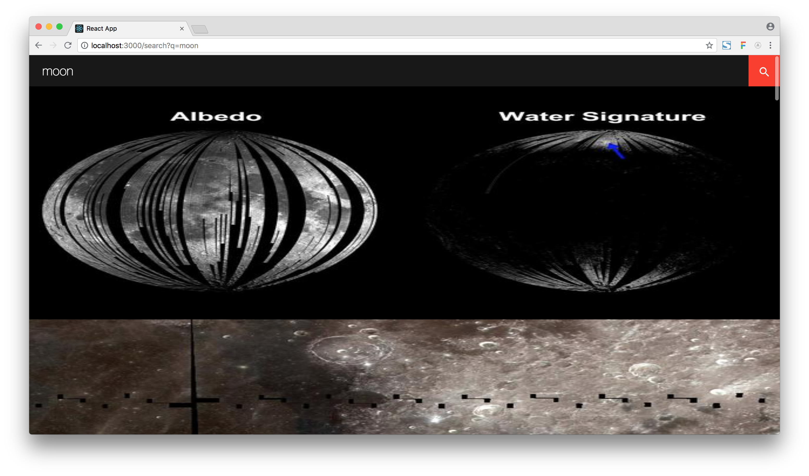

# Nasa Search



The application is deployed on Heroku [here](https://nasa-image-search.herokuapp.com/).

## Install

```bash
git clone git@github.com:joestephens/nasa-search.git
cd nasa-search
npm i
npm start
```

## Approach

For this application I used `create-react-app` so I didn't have to worry about Webpack / Babel configuration and could just focus on making something functional. 

Firstly, I thought about how the application might look and be used. I created a simple search bar and landing page. Large fonts, high contrasts and touch friendly clickable elements have been used for accessibility. `react-icons` has been used to bring Material Icons into the project. The benefit being that it brings in SVG icons which always render smoothly, but also it only imports the icons used so isn't heavy.

I then made a request to the API endpoint in Postman, passing in 'rocket' for the `q` query parameter, as I figured this would give me enough data to analyse. I copied the response JSON into the Chrome Developer Tools to get an idea of the shape of the data, and found a common pattern: each element in the response data array had both `data` and `href` keys. All the data had a `data.media_type` of either `audio`, `image` or `video`. If the `media_type` was image, there was also a `links` key on the top level of the element. I only got as far as images, so used the information in the `links` array to provide the media. If I had more time, I would've made a seperate request to the URL referenced in `href` and extracted the media sources from the array.

Once I had the data, I thought about how to send this down into a component. I decided to have two wrapper components (referenced to as "providers" in this project). The pagination provider provides current page state, the limit of results to show at once (10 by default) and a method to set the current page. There's also a results provider which is responsible for making a request (with `axios`) to the API, mutating the data, limiting it based on props passed down from the pagination provider, and passing it as a prop. The results provider determines the search query based on a query string. I went for this approach as it allows for linking to results pages.

I did start to run out of time at this stage, so quickly mocked up a quick results page. The images have just been set to 100% width, as from a mobile-first perspective this actually works quite well. The idea was to have this as a grid on larger screens.

## To Do

Unfortunately, I didn't have the time to do what I would've liked to have done on this exercise. These are the tasks in order of priority that I would go on to do next:

* [ ] Give feedback to the user (likely a small loading bar under the search box)
* [ ] Add a cross icon to the left of the search button to clear the query/results
* [ ] Populate value of search input from `q` query string
* [ ] Show images in a grid on desktop
* [ ] Create pagination numbers component to change the page
* [ ] Add a modal that pops up when you click on a thumbnail and gives more information about the image
* [ ] Add support for the video and audio media types
* [ ] Test components

Testing components isn't last here because I don't think it's important. If I had more time free to do the task I would've liked to have gone in with a test-driven approach.
